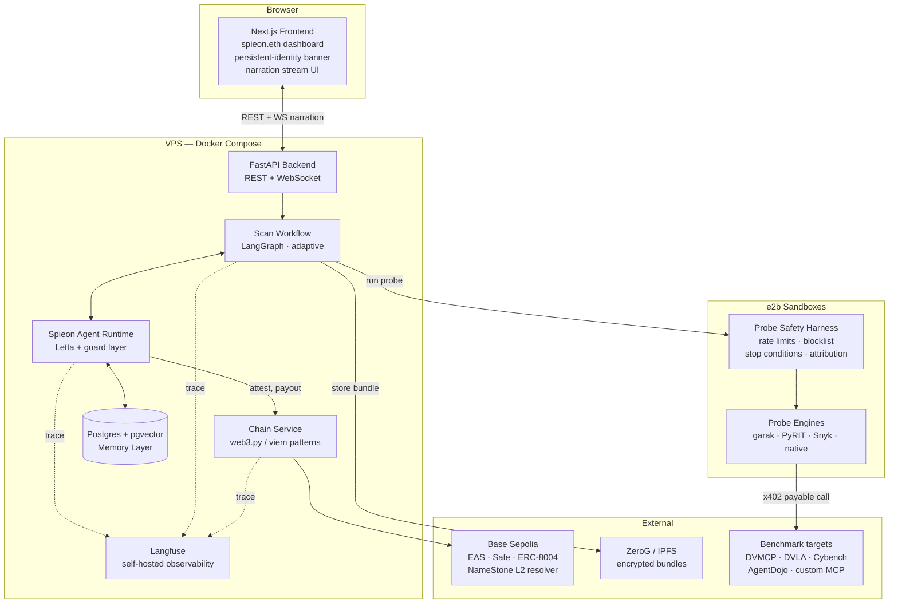
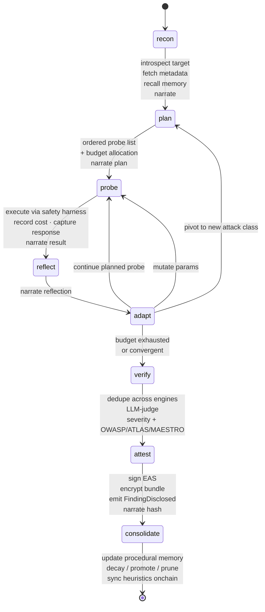
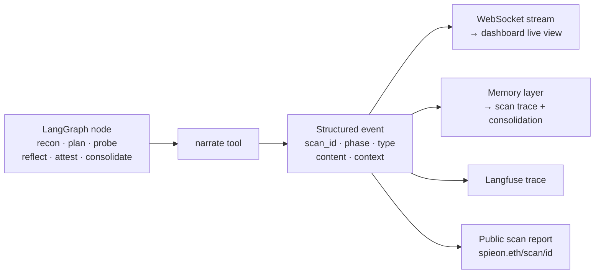
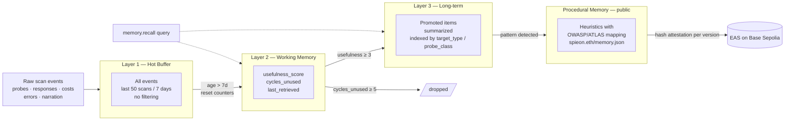
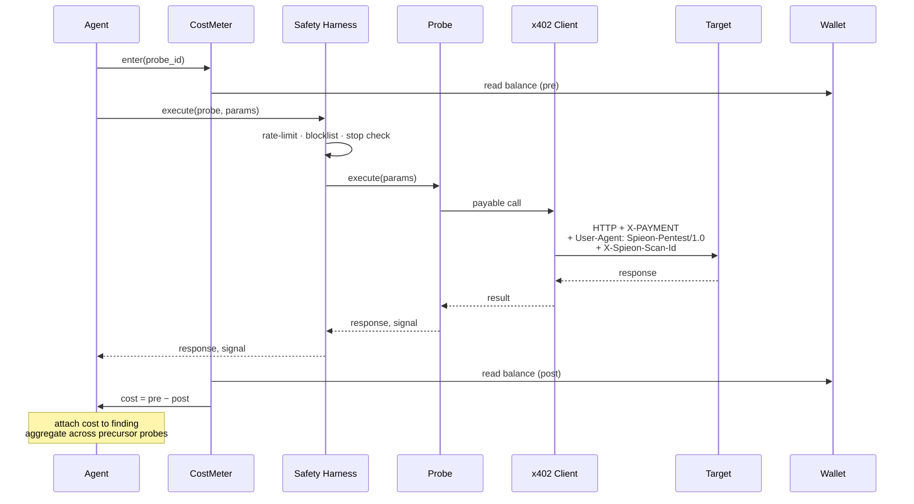
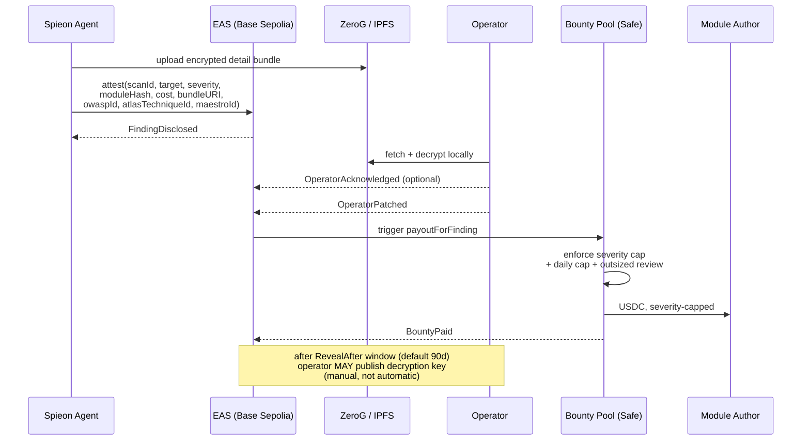
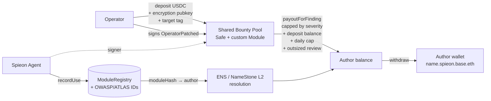
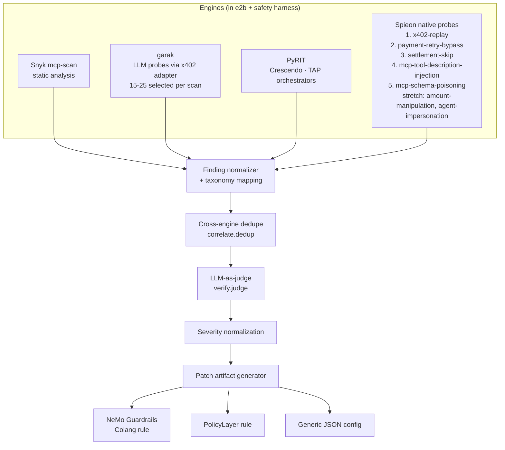
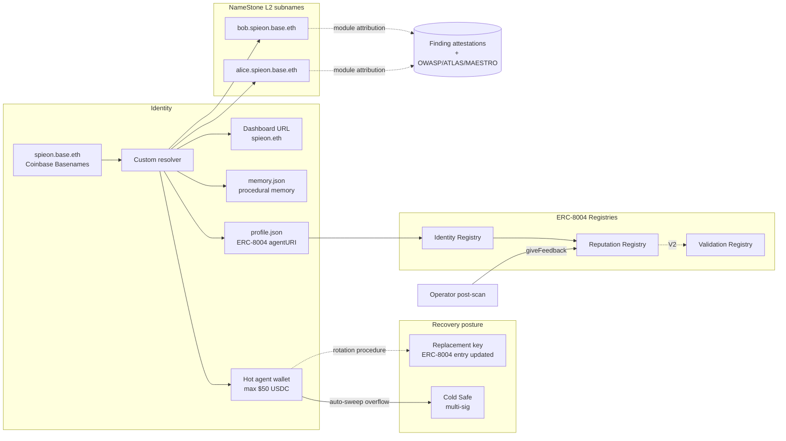

# Spieon — Architecture Diagrams

Visual companion to [PRD.md](PRD.md) (v2). Source of truth for behavior is the PRD; this file is for orientation.

## 1. Service topology

End-to-end view of components and where they run. Langfuse instruments every agent decision, tool call, memory operation, and chain interaction from day 1.

## 2. Per-scan adaptive workflow

LangGraph nodes for a single scan. Every node is checkpointable, and every node emits narration events — a crashed scan resumes at the next node, not from scratch. The reflect / adapt-decision loop is the genuine "thinking" beat: the planner can mutate parameters, pivot to a new attack class, or continue the planned probe list based on what the previous probe revealed.

## 3. Reflection-as-narration

Every meaningful decision emits a structured narration event that fans out to four destinations. This is what makes the demo "watch the agent think" rather than "watch a progress bar."

## 4. Memory architecture

Three-tier consolidation with deferred pruning. Negative examples (failed probes) survive long enough to become diagnostic when paired with later positives. Procedural memory is public and hash-attested onchain per heuristic version.

## 5. Cost-of-exploit measurement

Every probe is wrapped in a `CostMeter` so the headline metric — *how cheaply could an attacker have found this* — is grounded in real on-chain spend. Aggregate cost includes failed precursor probes that contributed to the finding.

## 6. Defense layers — protecting Spieon and targets

Spieon's threat model is two-sided. Hostile target responses can try to manipulate Spieon; Spieon's probes can damage targets. Both defenses are built day 1–5, not bolted on.

```mermaid
graph TB
    subgraph Inbound["Inbound — defending Spieon"]
        TR[Target response] --> LG[LLM Guard scanner]
        LG --> Strip[Strip-and-flag<br/>known injection patterns]
        Strip --> Cap[Length caps]
        Cap --> Sub[Isolated sub-agent context<br/>cannot call tools directly]
        Sub --> Main[Main agent<br/>structured tool calls only]
        Main --> Validate[Tool-call validation<br/>· payouts only to registered modules<br/>· attestations only for recorded probes<br/>· memory writes scoped to scan]
    end

    subgraph Outbound["Outbound — protecting targets"]
        Plan[Planned probe] --> Rate[Rate limit<br/>60/min · 1000/hr per target]
        Rate --> Block[Destructive blocklist<br/>no DoS · no auth-brute >3<br/>no destructive writes]
        Block --> Stop[Auto-stop conditions<br/>· 5 consecutive 5xx<br/>· budget exhausted<br/>· max attempts reached]
        Stop --> Attr[Attribution headers<br/>User-Agent · X-Spieon-Scan-Id]
        Attr --> Exec[Probe executes]
    end

    subgraph Operator["Adversarial-operator mitigations"]
        Cap1[Per-finding bounty caps<br/>crit $5 · high $2 · med $0.50 · low $0.10]
        Cap2[Per-module daily cap $10]
        Review[Outsized payout review<br/>>$20 flagged]
        Hist[Operator history tracking<br/>FP rate → rate limit]
    end
```

## 7. Onchain disclosure timeline

The contract enforces the *timeline* of disclosure, not the *publication* of contents. Attestations carry full taxonomy (OWASP Agentic Top 10, MITRE ATLAS, MAESTRO). Auto-publish is V2.

## 8. Bounty flow

V1 simplification: one shared pool, severity-capped payouts, daily per-module cap as anti-spam. Module authors registered via NameStone L2 subnames where shipped, raw addresses otherwise.

## 9. Probe library composition

Four engine families feed a single normalized finding pipeline. Every engine runs inside an e2b sandbox wrapped by the safety harness. Each finding ships with a deployable patch artifact.

## 10. Identity and public artifacts

How Spieon presents itself to other agents and to humans. Module authors get NameStone L2 subnames (V1 if slack, V2 fallback to address mapping).

